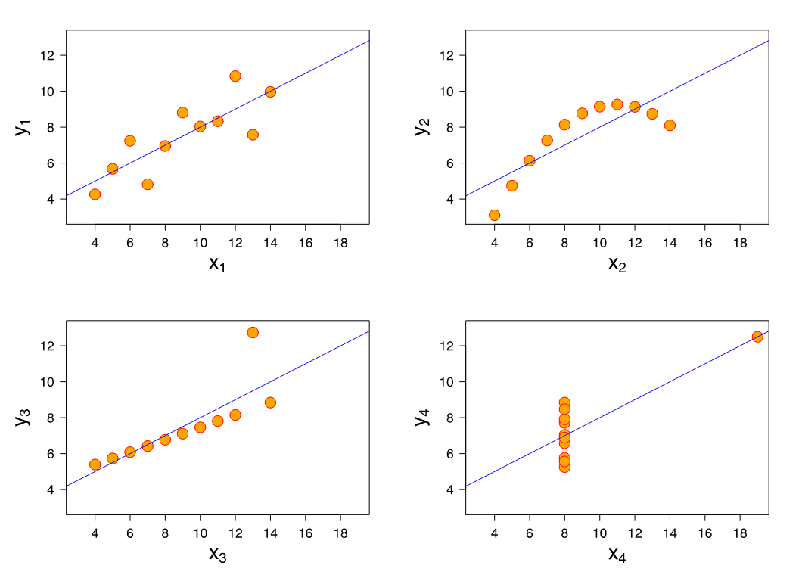

## Building Visualizations

### Ansombe's Quartet

Each of these datasets have the same mean, variance, regression line, and correlation!



### Making plots

A plot is a **mapping** from columns in your data to visual properties on your page. We call this the **grammar of graphics** or **"gg"**.

| Your Data   | Page (Columns)           |
|-------------|--------------------------|
| Estimate    | Position on the $y$-axis |
| Population  | Position on the $x$-axis |
| Reliability | Color of points          |
| M.o.E.      | Size of points           |

To use `ggplot2`:

1.  `ggplot(data)` creates a blank canvas using your `data`. You can leave the `()` blank if you're using more than one dataset.
2.  `aes(...)` describes "aesthetic mapping" of columns. **NO DECORATING. JUST BUSINESS.**
3.  `geom_*()` describe the kind of chart you're making. **This is where you decorate your plot**.

```{r}
#| eval: false
ggplot(tract_data) + 
  aes(x=population, y=moe_pct) + 
  geom_point()
```

Inside `aes()`:

- `aes(color=reliability)`

**NOT** inside `aes()`:

- `geom_point(color='blue')`

| What I want to know             | `geom()`                            |
|---------------------------------|-------------------------------------|
| How a variable is spread        | `geom_histogram()`                  |
| How two variables relate        | `geom_point()`                      |
| How do groups compare           | `geom_boxplot()`, `geom_barchart()` |
| How things change over time     | `geom_line()`                       |
| How uncertain a value is        | `geom_errorbar()`                   |
| Multiple variables across plots | `facet_wrap(~realiability)`         |

## Cleaning up an ugly chart

There are numerous things we can do to a default chart to make it more readable.

`arrange()` and `slice_head()` trims down the amount of data in the chart.

```{r}
#| eval: false 
arrange(desc(moe_pct)) |> 
  slice_head(n=15)
```

`coord_flip()` turns a chart on its side.

`(aes(x = reorder(NAME, estimate), y = estimate))` reorders the $x$ axis by estimate, rather than alphabetically.

`mutate(NAME = str_remove(NAME, " County, New York"))` rewrites name of string values in a column by removing `" County, New York"` from the county name – so `"Nassau County, New York"` becomes `"Nassau"`.

`geom_errorbar(aes(...), width = 0.3)` changes the width of the error bars.

Adding `fill = 'steelblue'` to `geom_bar()` and `theme_minimal()` will provide a new theme to the graph.

`scale_y_continuous(labels = scales::comma)` adds commas to numbers on the $y$ axis.

`labs()` allows us to add labels to the plot.

## Margin of Error

The census does not use the percent margin of error in its estimates. Instead, it uses the Coefficient of Variation (CV).

It is the relative measure of sampling error:

$$\text{CV}=\frac{\text{Standard Error}}{\text{estimate}} \times 100$$

Standard Errors come from a calculation of how many people you asked, and how varied that sample is. To get a standard error using a 90% confidence interval:

$$\text{Standard Error} = \frac{\text{Margin of Error }(E)}{1.645}$$

For a sample of 10,000:

- 15% CV -\> High reliability

- 15-30% CV -\> Medium reliability

- 30% CV -\> Low reliability; High sampling error

### Derived Uncertainty

$$\text{Poverty rate}=\frac{\text{\# in Poverty}\pm E}{\text{Total Population}\pm E} $$

### In R:

`moe_sum()`: adding estimates together

`moe_prop()`: one estimate as share of another

`moe_ratio()`: \# in Poverty/HH income; one is not a subset of another

### Change over Time

1.  Overlapping intervals 2019-2023, 2018, 2022
2.  Non-overlapping intervals 2014-2018, 2019-2023

We can't take the difference between estimates as the absolute change between intervals **without taking into account margin of error** $E$.

### The Standard Error of Difference

$$SE_{\text{diff}}=\sqrt{(SE_1)^2 +(SE_2)^2}$$

::: {.callout-note title="Example"}
1.  2014-2018: \$45,000 $\pm$ 8,000
2.  2019-2023: \$62,000 $\pm$ 11,000

We want to know if these estimates are truly different from one another.

$$SE_{\text{diff}}=\sqrt{(\frac{8{,}000}{1.645})^2+(\frac{11{,}000}{1.645})^2} \approx 8,626$$

$$\text{Difference}=\pm(1.645\times SE_{\text{diff}})$$

$$\text{Interval}=17{,}000\pm (1.645 \times 8{,}268)=17{,}000\pm13{,}601 =[3{,}399,\ 30{,}601]$$

$$Z = \frac{62{,}000-45{,}000}{SE_{\text{diff}}} \approx 2.06 $$

Since the 90% confidence interval for the difference $[3{,}399,\ 30{,}601]$ doesn't contain zero (equivalently, $Z \approx 2.06 > 1.645$), we can say with 90% confidence that the estimate genuinely increased from 2014–2018 to 2019–2023.
:::

Code from the practice exercise:

```{r}
#| eval: false 
poverty_tested <- poverty_wide %>%
  mutate(
    change   = `estimate_2019-2023` - `estimate_2014-2018`,
    se_1     = `moe_2014-2018` / 1.645,
    se_2     = `moe_2019-2023` / 1.645,
    se_diff  = sqrt(se_1^2 + se_2^2),
    moe_diff = se_diff * 1.645,
    z        = change / se_diff,
    significant = abs(z) > 1.645
  )
```
