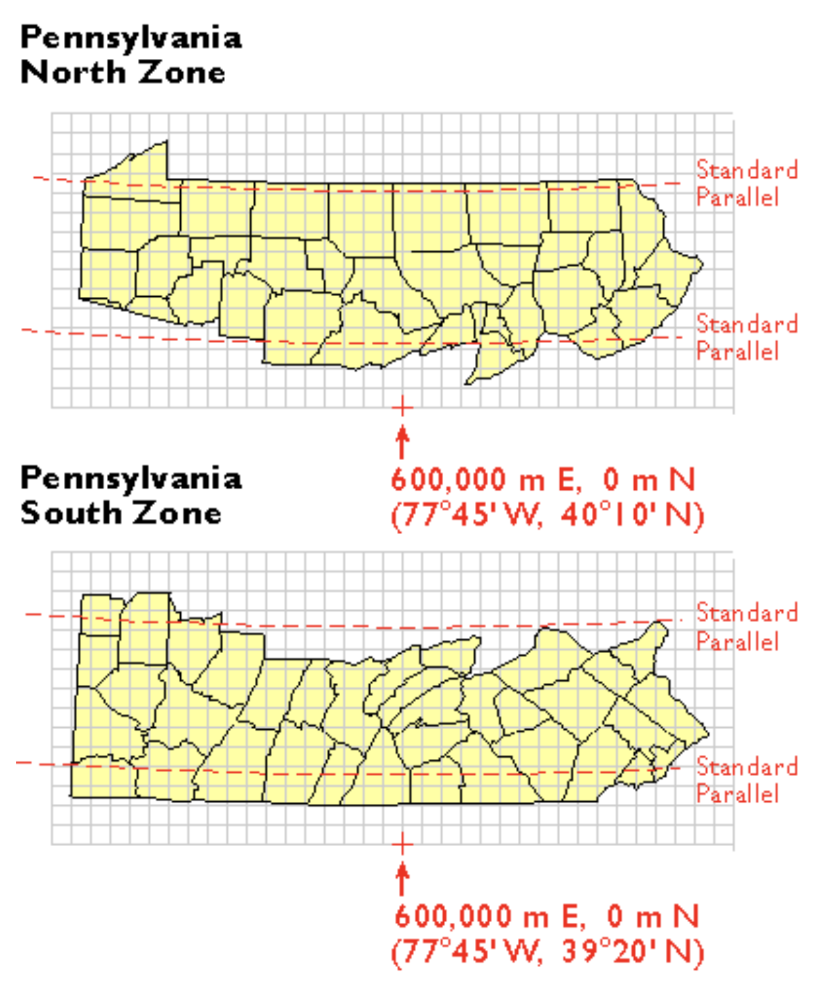

## Review from Week 3

**Example:**

Take a census tract where bike usage goes from 25% to 20% between the 2023 and 2015 5YE.

The `moe` in the data is tied to the 90% confidence interval. It's the range of values where the true, unknown value lives.

|      | Estimate | Margin of Error |
|------|----------|-----------------|
| 2015 | 20%      | ±3.0            |
| 2023 | 25%      | ±4.0            |

It's important to know that we can't just add the margins of errors. We need to convert it to the standard error $SE$. For our example:

$$
SE_{2015}=\frac{3}{1.645}=1.82
$$

$$
SE_{2023}=\frac{4}{1.645}=2.43
$$

To get the difference of the standard errors:

$$
SE_{\text{diff}}=\sqrt{SE_{2015}^2+SE_{2023}^2} = 3.04
$$

$$
Z=\frac{25-20}{3.04}=1.64
$$

Since $1.64 \le 1.645$, we cannot reject $H_0$ that the difference is due to sampling noise.

## Joining Tables

**Table 1:**

| `GEOID` | `med_inc23` |
|---------|-------------|
| `100`   | `82000`     |
| `200`   | `31500`     |
| `300`   | `45000`     |

**Table 2:**

| `GEOID` | `med_inc15` |
|---------|-------------|
| `100`   | `61000`     |
| `200`   | `27000`     |
| `400`   | `39000`     |

**The operation `left_join(income_23, income_15, by=GEOID)` results in the output of this table:**

| `GEOID` | `med_inc23` | `med_inc15` |
|---------|-------------|-------------|
| `100`   | `82000`     | `61000`     |
| `200`   | `31500`     | `45000`     |
| `300`   | `45000`     | `NA`        |

### Join Types

`left_join()` keeps only rows that are in the "left" (first specified) table

`inner_join()`: keeps only common rows between both tables

`full_join()`: keeps all rows in both tables

## Coordinate Reference Systems (CRS)

When you request census data through this method:

```{r}
#| eval: false 
get_acs(..., geometry=TRUE)
```

It adds a `geometry` column with geometric data in a coordinate reference system!

### Geographic CRS

The true shape of the earth is a lumpy **geoid** and we can't really put a grid on it. Instead, we approximate the shape of the Earth with an **ellipsoid**. There can be many types of ellipsoids.

No matter how we draw an ellipsoid, it's never going to perfectly match the geoid.

Lines of latitude and longitude derived from a specific ellipsoid can be referred to as a **datum** or a **geographic coordinate reference system**. For example, the North American Datum of 1983 (NAD83) has the ellipsoid of GRS-80. Whenever coordinates are given in latitude/longitude, they are from a **geographic CRS**.

The **World Geodetic Datum of 1984** (WGS84), like NAD83, is Earth-centered via satellites. It is the standard for GPS data and is global (rather than NAD83, though it is not that far off).

However, when you're doing spatial analysis, you are typically not going to measure in degrees.

### Projected CRS

When we project a 3D object onto a 2D object, the shapes, area, distance, and direction will be distorted. All projected CRS start out with a 3D model of the Earth which then will be flattened.

The issue is that the flat surface will not touch all of the parts of the Earth perfectly. Where the Earth touches the projection, it will be projected perfectly. Everywhere else will be projected larger and distorted. The **tangent line** is where there is the least distortion.

The Mercator projection is cylindrical, and areas closer to the poles have extreme size distortion. **Conic** projections are better for countries like Russia and Canada at higher latitudes. **Transverse cylindrical** projections run along lines of longitude, and are better for continents like the Americas that are very long north-south. **Planar** or **azimuthal** projections are good for the poles.

### Choosing a CRS

We need to select a datum and a type of projected CRS.

Projected CRS are good for local mapping. For example, state planes are used to minimize distortion within certain parts of the state. They are measured in both feet and meters.



**Universal Transverse Mercator Zones** divide the Earth into 60 vertical zones, each 6 degrees wide. UTM coordinates are in meters and do not have negative numbers.

::: callout-important
Say we're checking `st_crs(data)` and our CRS is missing or labelled incorrectly.

We will then use `st_set_crs()` to set a CRS and label the CRS correctly.

To **change** the CRS, use `st_transform(stations, 2272)`. Since we are using the correct units, we can then do spatial operations such as `st_buffer(stations, 500)`
:::

## Spatial Analysis

Anything dealing with spatial data will have a prefix of `st` before the method.

### Boolean operations

- `st_intersects(A, B)` returns a boolean value on if A or B intersect.

- `st_touches(A, B)` returns a boolean value on if A or B share a border.

- `st_within(A, C)` returns a boolean value on if C is completely within A.

### Filtering operations

- `st_filter()` selects features based on a specified distance

- `st_intersection()` creates a new polygon based on the overlap between two

- `st_union()` is like `st_intersection()`, though it keeps the polygon boundaries within the overlap

### Joining operations

- `st_join()` performs spatial joins (ex. assigning tract attributes to each station)

- `st_distance()` returns a matrix with the distance between every station and tract
